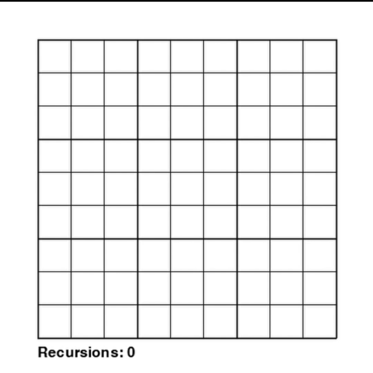

# Sudoku Solver and Visualizer

This project provides a Sudoku solver and visualizer using Python and Pygame. It includes functionality to solve Sudoku puzzles and visualize the solving process.

## Features

- Solve Sudoku puzzles of varying difficulty.
- Visualize the solving process using Pygame.
- Run the solver in headless mode.

## Installation

1. Clone the repository:

   ```sh
   git clone https://github.com/StenerNordnes/Sudoku.git
   cd sudoku-solver
   ```

2. Create a virtual environment (optional but recommended):

   ```sh
   python -m venv .venv
   ```

3. Activate the virtual environment:

   - **Windows**:

     ```sh
     .venv\Scripts\activate
     ```

   - **macOS and Linux**:

     ```sh
     source .venv/bin/activate
     ```

4. Install the required dependencies:

   ```sh
   pip install -r requirements.txt
   ```

## Usage

### Running the Visualizer

To run the Sudoku solver with visualization, execute the following command:

```sh
python Sudoku_solver.py
```

## Example

Here is an example of the visualizer in action:



## Solving Process Using CSP

The `CSP` (_Constraint Satisfaction Problem_) class is used to solve the Sudoku puzzle using a backtracking algorithm. Here is an overview of the solving process:

1. The `backtracking_search` method is called with the initial Sudoku board.
2. The current assignment is checked for consistency using the `isConsistent` method.
3. If the current assignment is not consistent, the algorithm backtracks by returning `None`.
4. An unassigned variable (i.e. an empty cell) is selected using the `select_unassigned` method.
5. If all variables are assigned, the puzzle is solved and the solution is returned.
6. The possible values for the selected variable are fetched from `self.domains[var]` and is shuffled to for an opportunity to solve the puzzle faster.
7. For each value in the domain, the value is assigned to the variable and the `backtrack` method is called recursively.
8. If the recursive call returns a valid solution, the solution is returned.
9. If the recursive call returns `None`, the value is removed from the assignment and the next value is tried.
10. If no value in the domain results in a valid solution, the algorithm backtracks by returning `None`.

### The CSP Class

The `CSP` class is defined in the `csp.py` file and can be used to solve any CSP problem not only Sudoku. The class provides the following methods:

- `backtracking_search`: The main method to solve the CSP problem using backtracking.
- `select_unassigned`: Selects an unassigned variable (i.e. an empty cell in Sudoku).
- `isConsistent`: Checks if the current assignment is consistent with the provided edges.
- `backtrack`: Recursive method to solve the CSP problem.
- `ac_3`: The AC-3 (_Arc Consistency 3_) algorithm to reduce the domain of variables.
- `isAllAssigned`: Checks if all variables are assigned.

As parameters, the `CSP` class takes the following:

- `variables`: A list of variables (e.g. cells in Sudoku).
- `domains`: A set of possible values for each variable.
- `edges`: A list of edges (i.e. constraints) between variables, that specify which variables that cannot have the same value.

#### Arc Consistency 3 (AC-3)

The `ac_3` method is used to reduce the domain of variables by enforcing arc consistency. The method iterates over all edges and removes values from the domain that are inconsistent with the edge. If the domain of a variable is reduced, the method returns `True` to indicate that the domain has been changed.
This is run prior to the backtracking search to reduce the search space. It uses the already assigned variables to reduce the domain of the unassigned variables.

```python
def ac_3(self) -> bool:
   for edge in self.edges:
      domain1 = self.domains[edge[0]]  # Domain of variable 1
      domain2 = self.domains[edge[1]]  # Domain of variable 2

      newDomain1 = set()
      newDomain2 = set()

      # Iterate over all possible combinations of values from domain1 and domain2
      for value1 in domain1:
            for value2 in domain2:
               # Check if the values are different
               if value1 != value2:
                  # Add the values to the new domains
                  newDomain1.add(value1)
                  newDomain2.add(value2)

      # Update the domains with the new values
      self.domains[edge[0]] = newDomain1
      self.domains[edge[1]] = newDomain2
```
